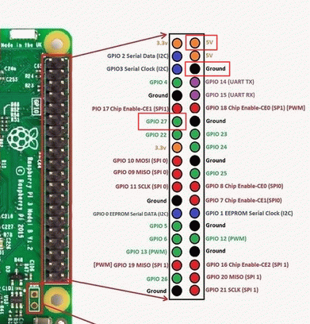

# pie_sensor

sensors.py is the app that obtains data 433 sensors like weather and alarm sensors including smoke and water leak sensor.
It works via wl433 connected to GPIO Raspeberry PI pins.

mosquitto

nexus, digoo

mqttmon.py
gtk gui
